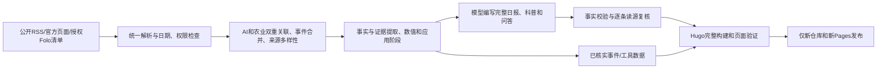

# 秋秋 AI 农业日报修改方案

日期：2026-10-05（北京时间）。状态：分析与方案，尚未实施。本次只写文档，不改业务代码、工作流、Secrets、DNS或线上内容，不触发模型生成、Git推送和部署。

## 1. 修改目标与结论

把网站改为以 **AI + 农业的新闻、知识和应用** 为主体的日报。读者打开首页就能读最新一期，理解AI正在解决什么农业问题、哪些工具已经可用、哪些还在研究阶段。游戏迁往辅助页，只保留不显眼的入口。

建议页面显示名称为“秋秋 AI 农业日报”，项目名称、两个独立仓库及 farm.aibioo.cn 不变。品牌文案属于本方案建议，不编造家人的理念、身份、经验或引语。

以原AI日报的完整阅读和资讯组织能力为功能基线，逐项迁移、按农业改写。此前“不新增雷达/时间线”的产品范围，按本次最新要求调整为农业版功能；旧站、旧域名与旧服务继续只读。账号商品、旧广告、旧业务凭据不属于可迁入的新项目内容。

受众调整：第一层是希望读懂AI农业的普通读者、农业与园艺爱好者；第二层是农场/合作社从业者、农业学生、开发者。阳台种菜保留为部分应用场景，不再限制整份日报的选材。

## 2. 只读审查发现

| 发现 | 证据 | 修改意义 |
|---|---|---|
| 游戏占首页首屏 | 当前 layouts/index.html 先渲染六块地，最新日报在旁边；正式首页HTTP200且仍含该结构 | 首页重排为阅读，游戏移走 |
| AI农业主题缺少采集入口 | config/sources.json 主要是CAAS/农业信息网及UMD、UW、Iowa、RHS种菜资料；索引偏普通园艺 | 更换来源池、增加AI与农业双重关联门禁 |
| 稿件信息量被过度限制 | generate.mjs 每源截取最多140字符；core.mjs 广泛禁止数字；editorial.mjs 大量固定“打开原文” | 扩大证据上下文，核验数值，生成具体但有条件的解释 |
| 原站阅读功能没有完整迁入 | 原模板含月度侧栏、文章目录、更新日期、上下篇、归档、搜索；当前模板只剩正文及简单列表 | 直接复用稳定阅读模板和主题，不再逐个临时补小组件 |
| 原站有明确栏目 | [原日报首页](https://news.aivora.cn/)有今日TOP、产品技术、开源、社媒、趣闻、相关问题 | 保留栏目能力，换成农业选材和编辑规则 |
| 雷达是独立项目 | [原雷达](https://radar.aivora.cn/)提供搜索/筛选、三条简报、随机发现、本地收获卡；源码入口指向 dongyu19920904/ai-news-radar | 只读审计其源码后再迁农业功能，不能把导航链接当成已经移植 |
| 自动化尚缺未来定时证据 | 本次读取的最近4条生成器执行均为10月4日workflow_dispatch；正式首页仍指向10月4日 | 实施时单独验收跨日正常生成；本轮不推断定时失败、不自动补跑 |

代码参考固定版本仍为前端 ab145429e99b2752c3078c333bfe522acd6b0f0b、后端 1a2eb2d71a87f67ed428bea3af258dcf8d9697d6。通过已有只读参考副本检查，不复制脏工作树。实施前再核对远端新稳定版本的差异，记录最终移植SHA。

原站有些入口是其他项目或业务链接，不能用改字冒充完整功能。原站 comments 配置为关闭；计划不新增账号或在线评论系统。

## 3. 原功能逐项迁移表

| 原功能 | 农业版目标 | 处理方式与验收 |
|---|---|---|
| 首页直接展示最新日报全文 | 首页即最新AI农业日报 | 保留日期、更新时间、导读、目录、完整静态正文；无需先点“阅读完整日报” |
| 今日TOP栏目 | 今日AI农业精选 | 保留TOP栏目组织能力。默认5–8条核心事件，足够时可在后续规则中扩展TOP10；不足不凑10，不把同事件分拆到多个栏目 |
| 产品/模型/技术进展 | 农业AI工具、机器人、遥感与研究 | 每条明确AI作用、农业问题、应用阶段和限制 |
| 开源项目 | 农业开源工具与数据集 | 核对仓库、许可证、更新日、硬件/数据要求；不搬通用GitHub热门榜 |
| 社媒精选 | 农业实践与研究者观察 | 人工筛选Folo来源；重要事实回溯论文、厂商或机构原文，社媒内容不能独立证明效果 |
| AI趣闻 | AI农业趣闻/有趣案例 | 栏目能力保留，有真实素材才展示，不生成虚构农民故事或假笑话 |
| 相关问题FAQ | AI农业问答 | 回答读者实际问题，链接证据；去除账号导购套话 |
| 月度侧栏与往期归档 | 按年/月浏览真实日报 | 复用归档结构，最新标识、期数、上下篇；不复制旧AI文章 |
| 文章目录和锚点 | 桌面目录、手机折叠目录 | 点击定位、长标题换行、阅读时可快速返回 |
| 全站正文搜索/Ctrl+K | 搜日报、工具、科普与往期 | 复用稳定FlexSearch/主题组件，重新生成农业正文索引；查得到正文而非只搜标题 |
| 标签、分类 | 视觉识别/农机机器人/遥感/温室水肥/农业大模型/育种数据等 | 启用真实taxonomy，从结构化数据生成，不堆SEO关键词 |
| 日夜、移动、面包屑、上下篇、更新日期 | 保留整套阅读体验 | 390px与桌面实测，链接/日期一致，不继续显示“回到小农场” |
| 图片、图注与自然来源链接 | 使用对应原材料、许可合适的图片 | 继承渲染与排版能力；许可不明无图，不复制图片代理或任意下载外图 |
| AI时间线 | AI农业事件时间线 /timeline/ | 基于经过验证的事件、原始发生/发布日期生成；日期/主题筛选、详情与原文；复用功能而非旧事件 |
| AI雷达 | AI农业资讯雷达 /radar/ | 搜索、分类/源筛选、去重、源状态、三条简报、随机发现、本地收获卡；静态JSON，展示真实更新时间 |
| AI商机 | AI农业应用机会 /opportunities/ | 谁存在什么需求、现成工具/数据、实现门槛、验证步骤、风险；推断与事实分开，不承诺收益 |
| AI账号商机/店铺/广告/跨站业务 | 不迁旧商业内容 | 农业工具评估和应用机会承接有用能力；不预设出售账号、支付、商城或广告 |
| 中英文配置 | 预留原多语言能力 | 中文作为本次必验收版本；英文若启用，须有真实翻译及同步日期，不保留空切换或旧英文站名。是否发布英文版另列可选范围 |
| 订阅和SEO | 日报RSS、静态文章SEO | 新项目RSS含真实正文/链接；canonical、Article、Breadcrumb、sitemap、robots更新 |

本次优先恢复原Hugo/Hextra阅读骨架，连同必要模板、搜索脚本和相关样式按固定版本迁入。参考副本中的Hextra LICENSE核实为MIT；保留声明。清除旧品牌、广告、统计ID、验证文件、旧CNAME和业务菜单。主题可用版本以审计SHA固定，不顺手升级到未知版本。

## 4. 首页及页面结构

桌面采用原日报的阅读布局：顶部简洁导航，左侧月份/栏目，中央最新一期正文，右侧本期目录。手机保留搜索与日夜入口，月份/栏目和目录折叠。白色日间阅读区、清晰中文及数字、少装饰，农业图片提供色彩。

建议主导航：日报｜AI农业知识｜工具与数据｜时间线｜雷达｜应用机会｜搜索。手机将较低频入口收入“更多”。“轻松种田”只在更多菜单或页脚出现。

首页顺序：

1. 秋秋AI农业日报、真实本期日期与更新时间、阅读时间。
2. 今日导读：用几句话说明本期值得看的AI农业变化。
3. 今日精选5–8条及完整正文。
4. 工具/研究/实践栏目、AI农业小课、FAQ；没有合格素材的可选栏目隐藏。
5. 往期入口、RSS与来源说明。

新增/调整路由：/（最新全文）、/daily/（归档）、/knowledge/、/tools/、/timeline/、/radar/、/opportunities/、/farm/（辅助游戏）、/sources/（来源与方法）。知识、工具和机会详情各有永久链接。

保留 /daily/2026-10-04/ 及真实旧内容，标注为早期种植版，不改日期、不伪装成AI农业新刊。后续合格新稿上线后首页自然指向新刊。

游戏迁往 /farm/，保持原localStorage键与存档版本、库存和奖励幂等；日期从合格最新日报读取。游戏UI对知识题缺失有处理，不再假定首页一定有菜地或答题DOM。首页、日报与搜索不加载游戏引擎脚本，不弹窗、不以奖励阻止阅读。

## 5. 内容标准：AI必须是主题的一部分

主题范围：作物视觉识别与表型、病虫识别的辅助判断、农业机器人/无人机、遥感农情、智能温室和灌溉、农业大模型与农技Agent、育种与数据集、畜牧水产及农业供应链。普通浇水/基质文章转入背景知识库，不再填满新闻栏目。

核心事件必须有证据支持的“AI技术/能力 + 明确农业场景”。单有农业新闻或AI产品新闻都不够；设备宣称“智能”也不足以证明使用AI。一般行业政策只在直接涉及AI/数据/智能农业且内容重要时收录。

每条内部数据记录：事件、AI承担的任务、输入/输出、农业问题、应用阶段（研究/原型/试点/商用）、适用人群和条件、试用入口或了解路径、限制、证据、日期。页面用自然的两三段讲清重点，避免每条重复一组空洞小标题。

读完至少能够回答：**AI具体做了什么？解决什么农业问题？现在能不能用？我要试，缺什么？有什么不能相信或照做？**

日报增加一则有来源的AI农业小课，例如“田间照片和实验室叶片数据有什么区别”“遥感模型需要哪些输入”“大模型农技回答为什么要核查”。科普不是今日新闻，单独标注知识属性，逐步沉淀到 /knowledge/。实践任务可以是观察、资料核对、数据整理或使用真实公开演示；不要求购买设备，也不在网页增加AI聊天接口。

事实与解释分开：标明厂商宣称、研究结果、编辑分析。不能把论文准确率解释为所有田间场景有效，把目标指标写成已实现，把试点写成全国可用。农药剂量、安全间隔和食用安全不由通用模型编配方。

数值不再一律删除：采用结构化事实槽保留原数值、单位、实验条件、样本/对照、原文位置和链接；模型只能引用已核对的槽，禁止自行计算或扩大结论。不同指标（准确率/F1/耗时/节水/成本）分别核验，不能只凭“原文出现同样数字”通过。无法核验的效果数字删除或明确不收录，不能靠删数字把文章写空。

## 6. 信息源方案及本次验证状态

以下是按AI农业内容筛选的起步名单；“页面核实”不等于RSS可用、robots允许或已接入。实施阶段需分别验证抓取许可、真实日期、正文解析和定时环境。

| 来源 | 用途 | 本次核实/接入建议 |
|---|---|---|
| [中国农科院中棉所AI温室报道](https://cri.caas.cn/sylm/zhdt/b8ade2b9c0cf4239859b9e6ff12b5262.htm) | 国内AI模型辅助设施农业的原始案例 | 真实机构页面已核实，适合扩展其公开科研栏目；未核实RSS，不能固定重复这篇 |
| [中国农科院农业信息研究所](https://aii.caas.cn/) | 农业AI、大数据、遥感研究与平台 | 官方检索结果确认主题相关，本次直接读取未成功；候选，不宣布已可采集 |
| [Iowa State AIIRA](https://aiira.iastate.edu/) | AI农业数字孪生与研究 | 官方首页核实相关；新闻/论文发现、robots及RSS待验证 |
| [UC Davis AIFS新闻](https://aifs.ucdavis.edu/news) | AI农业生产、食品系统、工具和研究 | 官方首页与新闻索引可读，已确认有真实研究/活动区分；RSS未核实 |
| [USDA NIFA AI专题](https://www.nifa.usda.gov/grants/programs/data-science-food-agricultural-systems-dsfas/artificial-intelligence) | 分类依据、科普与研究机构发现 | 官方专题可读；主要作背景，不把旧专题当每日新消息 |
| [DJI Agriculture](https://ag.dji.com/) | 农机/无人机实际应用与产品资料 | 官方页面可读；逐条筛AI相关能力，并标厂商来源；机器人或无人机不自动等于AI |
| [John Deere Newsroom](https://www.deere.com/en-us/our-company/newsroom) | 机器视觉、农机与农业AI产品 | 官方检索可识别，本次正文读取不足；候选，需实测、不可承诺现成RSS |
| [arXiv API官方文档](https://info.arxiv.org/help/api/index.html) | 农业AI论文发现 | 确认官方API文档存在；实现农业场景×AI方法查询、低频读取，标预印本/版本日期，不能把预印本当同行评审成果 |
| [PlantVillage-Dataset原仓库](https://github.com/spMohanty/PlantVillage-Dataset) | 植物视觉数据集的教学/工具资料 | 原始仓库真实存在；许可、数据集域偏差与维护状态需专项核实，不视为现成田间诊断产品或今日新闻 |
| 用户在Folo筛选的专业媒体/研究者/行业源 | 补充时效性与多样性 | 收到清单后逐源验收，不能假定有Folo订阅就允许公开全文转载 |

另行核实国内大学农业AI团队、智慧农业专业期刊、农机与机器人研究机构。农业农村部门和权威农业媒体仍可作政策/事实来源，但必须通过主题筛选；已有robots禁止和403的源不绕过。AIFARMS、部分期刊站本次读取失败，只作为继续调研项，不提供猜测的订阅地址。

目标逐步建立约15–25个合适来源，覆盖中文机构、大学AI农业研究、产品官方、论文/代码和可信行业媒体。数量是来源池目标，不是日更能力证明；先观察近两周更新与相关率再启用。单机构最多两条核心事件，至少三个独立机构，不能用不同域名伪装机构多样性。

新闻先看近72小时，必要时放宽到7日并明确原始日期；新收录的旧论文、工具、教程只能放“研究/知识/工具”，不冒充今日发布。一个事件跨文章/社媒/论文的材料可合并为一条多证据事件，不能重复凑数。

## 7. Folo如何配合

原后端 folo-multi-feeds.js 支持多个feed/list ID、分页、时间过滤与来源映射，依赖独立API配置，认证条件需实际核验。本项目复用适配思路，不继承旧Cookie、旧源ID、旧Worker写入或登录恢复机制。

[Folo官方源码](https://github.com/RSSNext/Folo/blob/dev/apps/cli/src/commands/opml.ts)包含订阅OPML导入/导出实现。建议用户在Folo中建“AI农业”独立分组，再按以下方向筛选：农业AI研究、农业机器人/遥感、产品官方、工具/数据集、可信实践与行业媒体。先少量高质量源，观察更新后再扩大。

用户以后可提供以下任一材料，无需现在提供密码：

- 导出的农业订阅OPML（其他私人订阅可以剔除）。
- 原始RSS/Atom地址和标题清单。
- Folo农业list分享链接，或feed/list ID清单，注明类型与是否需要登录。

接入优先顺序：

1. OPML里的原始RSS/Atom：直接访问公开来源，不依赖Folo登录；导入前校验真实响应和正文。
2. 没有RSS但允许读取的官方索引：采用低频独立解析器。
3. 用户授权的Folo接口：只读取该农业清单，实测权限/分页/限额后接入，认证存独立Secrets。公开分享不保证API无需认证，feed ID也不是RSS地址。

不自动读全部私人订阅，不抽取浏览器Cookie；不提供猜测API或RSSHub路由。Folo失效时可继续其他合格来源；素材不够就停发，不用普通种菜资料补齐。

来源表建议字段：id、name、institution、homepage、transport、feedUrl或FoloId、idType、topic、language、accessPolicy、license、dateParser、lastVerified、status、priority。status区分candidate/verified/enabled/paused；内容证据记录最终原文URL，不把Folo当原作者。

## 8. 生成与发布架构

继续保留 Node24 + GitHub Actions + Hugo + 纯静态Cloudflare Pages。阅读/搜索/游戏不调用模型，不新增Worker、Cron或KV。

数据流：

重要改动：collect 拆成 RSS/HTML/Folo/论文/仓库元数据适配器；清除普通种菜默认优先规则。generate 拆为筛选、证据、写作和验证阶段，不用固定140字证据覆盖所有主题。core 的“一来源恰好一条”改为“一事件一条，可有多来源证据”；保持5–8核心条数、来源门禁和日期诚实。

复用原 dailySourcePrefetch、newsSourceDiversity、dailyWritingQuality、dailyMediaCoverage、dailyMarkdownAssembly、githubTopProjectDedupe 的适合逻辑/原则，先检查依赖与许可证再迁。农业专用配置和测试独立；旧业务耦合模块按接口改写，不整包迁入。生成器GPL声明保留。

输出结构化edition与events/tools/knowledge/opportunities数据，再生成Markdown及静态雷达/时间线JSON。各功能共用合格事实池，事件去重，避免每个页面重复付费改写。模型先在一次主稿中完成核心栏目，备选仍有限；是否需要单独机会稿须在测量token与质量后决定，不默认增加每日多次调用。

保留北京时间08:37生成、09:49补跑、dispatch、并发锁、超时、有限重试、合格当期跳过。以后用schemaVersion=2和明确topic=ai-agriculture校验新版稿，不覆盖合格旧版文章。新稿只写新项目，完整构建及复核通过后部署。当天已有早期种植版时，新版先在草稿/预览地址验收，不借更新schema强行覆盖旧文章。

雷达初版随来源采集刷新，展示“最近采集时间”和真实时间窗口；不能把近24小时筛选宣传成实时刷新。若日更不能达到所需雷达体验，再单独评估更高频Actions和额度，不为了原功能复制旧Worker/KV架构。

现有每月token估算只针对短摘要，修改后作废。用一次完整新稿的输入/输出/备选次数及Hugo/采集耗时重算成本；模型单价、余额与Actions剩余额度仍待核实。只写方案阶段不进行付费测试。

## 9. 文件改动范围与实施顺序

| 阶段 | 主要工作 | 可查看产物与通过条件 |
|---|---|---|
| A：功能/来源锁定 | 原站功能清单补齐、主题及雷达源码审计、Folo/公开源验证、迁移许可 | 每项功能有实现位置；来源表区分候选/可用；不依赖猜测接口 |
| B：阅读骨架 | 迁入Hextra必要主题/模板，首页全文、侧栏、TOC、搜索、归档、标签、分页；游戏移页 | 本地桌面/390预览，首屏是日报；旧存档继续可玩 |
| C：农业AI编辑链 | 新来源适配、双重相关度、事件/证据结构、数值/阶段验证、完整栏目 | 用最终代码真实生成一整期，逐条读源，达到第10节内容门槛；失败修复再试 |
| D：配套功能 | 知识/工具/时间线/雷达/应用机会真实数据与交互 | 所有导航有实质内容、功能可用，无假数据空壳；可选栏目无素材时诚实隐藏 |
| E：回归与发布 | 旧稿兼容、跨日期、多期搜索、SEO、缓存/隔离测试、预览与正式部署 | 新Pages预览通过后只发布新项目；正式首页和当期页实测；保存回滚版本 |

前端预计涉及：hugo.toml；layouts/index、single/list与阅读partials；主题/相关assets；搜索/目录/雷达/时间线脚本；独立farm模板及游戏DOM守卫；content各功能页；tests/check-site/browser-check；来源与许可文档。不改当前已发布文章的日期和原始证据。

生成器预计涉及：config/source-manifest与主题规则；src/source-adapters、collect、evidence、editorial、generate、validation、render；evidence版本/日志；测试与daily.yml输出/构建检查。现有Secrets不批量导出，不修改旧仓库或旧部署。

每阶段先产出可读内容或实际页面，不用“导航都出现了”代表功能完整。最终正式发布应同时具备主体内容与计划必选功能；英文版、高频雷达刷新、无素材的趣闻不作为默认强制上线项。

## 10. 验收标准

内容：至少5条真实不同AI农业核心事件，默认5–8条、至少3个独立机构；全部有AI作用和农业场景证据；日期/单位/阶段/地域/成本条件准确。小课和FAQ有依据，不能“今天可以打开原文”铺满全篇。普通种菜资料不凑主栏目；无素材不能自动写成泛农业版。完整读稿由助手逐条读源完成并如实记录，真人农技签核另列状态。

功能：原功能迁移表逐项记录通过/未完成/明确排除及理由。首页最新全文、月归档、标签/主题、TOC/锚点、正文搜索与Ctrl+K、上下篇、日夜、图注、更新日期、RSS可操作。农业雷达、时间线和应用机会有真实数据和相应交互，不能仅提供回原站的链接。

游戏：只在 /farm/ 加载；首页390px首屏无菜地/种子/领奖按钮；页脚或更多菜单可找到。旧存档库存、播种浇水、奖励幂等、后台/离线/校时、坏存档和存储不可用回归通过。禁用游戏JS仍能完整阅读日报。

采集：RSS/Atom、HTML、Folo空结果/认证失效/分页、日期时区、跨源同事件、DOI/仓库重复、禁止路径、数值证据、不虚构AI功能及发布目标隔离测试。坏源退出不拖垮整个源池，剩余素材不足时保留线上。

呈现：Hugo构建、首屏全文、非空素材、长标题/链接/图片、390px触控和桌面、日夜对比、正文选择、来源跳转、搜索真实往期正文。至少两期合格真实新稿验证跨日/月最新选择和归档（不足时用测试fixture覆盖逻辑，不将fixture部署）。

发布：Article日期使用真实published_at、dateModified/lastmod同步，不继续忽略实际生成时间；canonical、Breadcrumb、sitemap、robots、RSS一致。定时正常链路有真实执行回执，前端最新日期与当期页一致。旧站/旧Worker/Cron/KV/Secrets/DNS无本任务写入；回滚只在新Pages和新仓库。

## 11. 风险与等待项

尚未获得用户筛选的Folo农业清单；不阻塞本方案，可先用核实公开源试稿。农业来源日更频率低于泛AI新闻，需要以真实观测判断是否稳定支撑5–8条，不能靠标题加“AI”维持日更。若素材不足，明确保留最近合格期及日期；不能隐藏延迟。

论文/产品宣传易夸大田间价值，指标必须保留测试条件；开源/数据集许可证分别核实。Folo认证可能过期，接口与RSS分开监测；照片/社媒/视频版权单独处理。完整稿信息量增加后模型成本需要重新小额测量。

这次仅交付方案。下一次实施应从阶段A/B/C推进，首先给出“完整阅读首页 + 一整期实用AI农业稿 + 游戏退到辅助页”的可验收版本，再完成D/E；不能再次用技术通过或游戏可玩代替日报内容实用。
